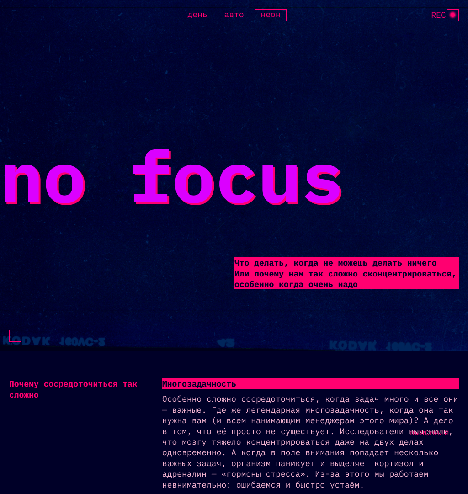
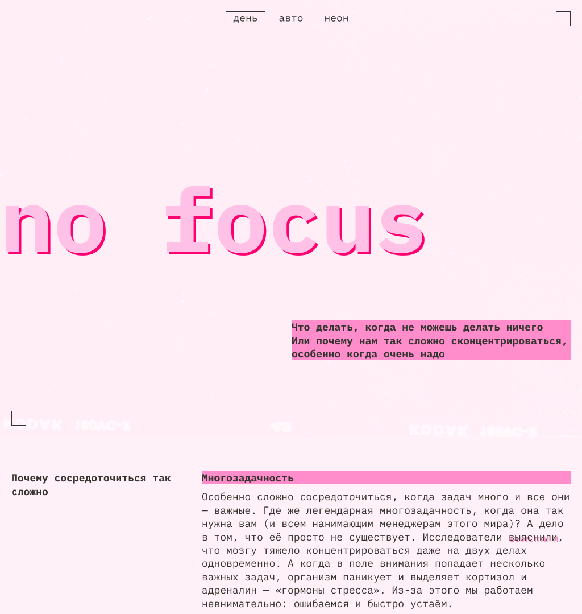

<h1>Проектная работа «Сложно сосредоточиться»</h1>

<table>
    <tr>
      <th>Темная тема</th>
      <th>Светлая тема</th>
    </tr>
    <tr>
      <td>
        
      </td>
      <td>
        
      </td>
    </tr>
</table>

<h2>Описание</h2>

Проект посвящен проблемам концентрации внимания.

Одностраничный адаптивный сайт в <i><b>светлой</b></i> и <i><b>темной темах</b></i>. В основе верстки - подход <i><b>"Mobile first"</b></i> и темная тема. Для адаптива под разные экраны используются <i><b>медиавыражения</b></i> (основные брейкпоинты - 375px, 768px, 1024px) и <i><b>"резиновая" верстка</b></i> (между брейкпоинтами). При смене темы происходит добавление JavaScript-кодом соответствующего класса для html (.theme-light, .theme-dark, .theme-auto) и переопределение значений <i><b>переменных</b></i>. При нажатии на кнопку "авто" отображается та тема, которая выбрана у пользователя в операционной системе на компьютере (срабатывает медиафича <i><b>prefers-color-scheme</b></i>). В проекте используется <i><b>методология БЭМ</b></i>.

<h3>Функционал:</h3>
<ul>
  <li>переключение темы оформления сайта (светлая/темная/авто).</li>
</ul>

<h2>Технологии</h2>
<ul>
  <li>HTML:
    <ul>
      <li>семантическая разметка;</li>
      <li>"ленивая" загрузка для изображений;</li>
      <li>атрибут aria-hidden="true" для элементов, не несущих смысловой нагрузки.</li>
    </ul>
  </li>
  <li>CSS:
    <ul>
      <li>grid layout;</li>
      <li>flexbox;</li>
      <li>логические свойства;</li>
      <li>псевдоклассы (nth-of-type, hover, focus, focus-visible);</li>
      <li>псевдоэлементы (before, after);</li>
      <li>переменные;</li>
      <li>относительные единицы измерения;</li>
      <li>функция clamp().</li>
    </ul>
  </li>
</ul>

<h2>Ссылка на макет</h2>
<a href="https://www.figma.com/file/lCqDbWjgllgJtb2hmCqfyX/%236-Сложно-сосредоточиться?type=design&node-id=601-480&mode=design&t=NItYLDjP8pf6dZaL-0">Открыть</a>

<h2>Ссылка на проект</h2>
<a href="https://juliadik.github.io/slozhno-sosredotochitsya/index.html">Открыть</a>